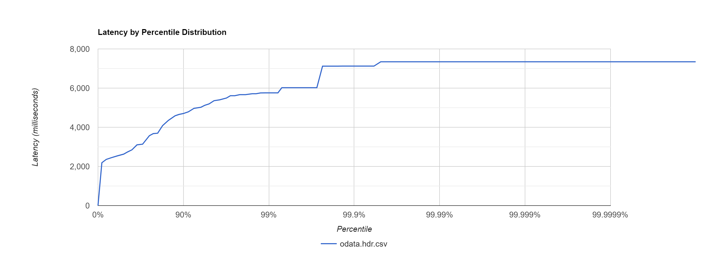
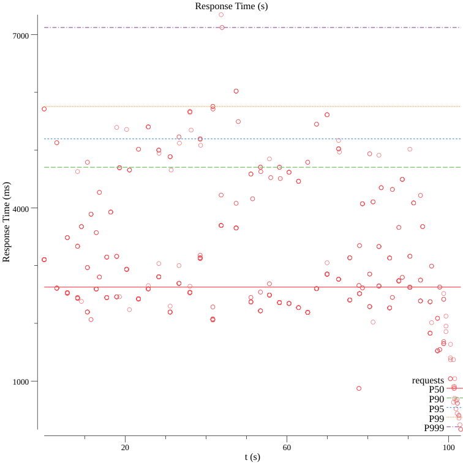
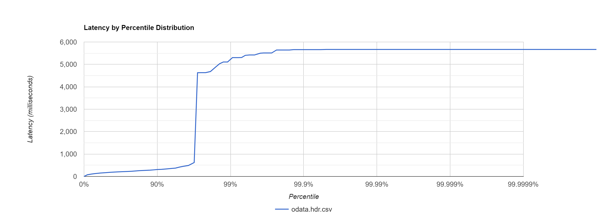
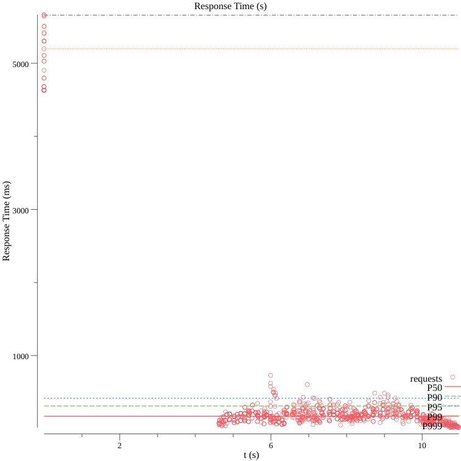

# About

This is a application to try and understand an implementation around Odata protocol with .Net Core.
In this case I use omdb-postgresql to create a scenario where we had database with bad practices and understand the performace and explore another tests in the future.

As sad in "About omdb"

> The database schema is intentionally not optimized (no indexes besides primary keys) in order to serve as a playground for database optimization.

[Click here to understand more about Omdb.](https://github.com/credativ/omdb-postgresql#about-omdb-postgresql)

And finally for create a uncommum scenario I decided to create this test with Postgresql

ATTENTION THE DATABASE IS INTENTIONALLY NOT OPTIMIZED!!

# Adding dependencies

## Adding Odata

```cmd
dotnet add package Microsoft.AspNet.OData
```

An essential element to working with Entity Framework Core is the command-line tooling.

```cmd
dotnet new tool-manifest
dotnet tool install dotnet-ef
```

## Adding EntityFramework
```cmd
dotnet add package Microsoft.EntityFrameworkCore.Design
dotnet add package Microsoft.EntityFrameworkCore.Relational
dotnet add package Microsoft.EntityFrameworkCore
dotnet add package Npgsql.EntityFrameworkCore.PostgreSQL
```

## How to run the Database

In this project we had a docker-compose file with an initial script to populate Omdb data, from 2022-11-29, with several datas.

Just run the following command in root directory:

```cmd
docker-compose up -d
```

## Using an Existing Database (Database-First)

The Npgsql EF Core provider also supports reverse-engineering a code model from an existing PostgreSQL database ("database-first"). To do so, use dotnet CLI to execute the following:

```cmd
dotnet ef dbcontext scaffold "Host=localhost;Database=odatadb;Username=postgres;Password=postgres" Npgsql.EntityFrameworkCore.PostgreSQL
```

## Metrics

I'm using "hey" to realize some stress test trhought odata-api.

> hey is a tiny program that sends some load to a web application.

[More about Hey.](https://github.com/rakyll/hey)

And hey-hdr to create awesome graphics with our test.

> The Extension to the excellent https://github.com/rakyll/hey load generator.

[More about Hey HDR.](https://github.com/asoorm/hey-hdr)

### Testing : )

Test case: What's the comportament of Api in front of 1000 request/seconds by 30 clients, at the same time?

```cmd
# -n is Number of requests to run. Default is 200.
# -c Number of workers to run concurrently.

hey -n 1000 -c 30 http://localhost:5100/api/MovieLink
```
## Results before database otimization:

```sql
SELECT m.movie_id, m.language, m.key, m.source
      FROM movie_links AS m
      ORDER BY m.key, m.language, m.movie_id
```
Below is the log of the query from api:

```cmd
info: Microsoft.EntityFrameworkCore.Database.Command[20101]
      Executed DbCommand (128ms) [Parameters=[@__TypedProperty_0='?' (DbType = Int32)], CommandType='Text', CommandTimeout='30']
      SELECT m.movie_id, m.language, m.key, m.source
      FROM movie_links AS m
      ORDER BY m.key, m.language, m.movie_id
      LIMIT @__TypedProperty_0
```




## Results after database otimization:

In this case the only modification was change the order of "order by columns" to realize only Index Scan in database. See commits in this path to:

> /App/Models/MovieLink.cs

```sql
 SELECT m.movie_id, m.language, m.key, m.source
      FROM movie_links AS m
      ORDER BY m.movie_id, m.language, m.key
```
Below is the log of the query from api:

```cmd
info: Microsoft.EntityFrameworkCore.Database.Command[20101]
      Executed DbCommand (2ms) [Parameters=[@__TypedProperty_0='?' (DbType = Int32)], CommandType='Text', CommandTimeout='30']
      SELECT m.movie_id, m.language, m.key, m.source
      FROM movie_links AS m
      ORDER BY m.movie_id, m.language, m.key
      LIMIT @__TypedProperty_0
```




# Environment

> Intel(R) Core(TM) i5-3317U Processor CPU @ 1.70GHz, 1701Mhz, 2 Core(s), 4 Logic Processor(s)
> 16 GB RAM
